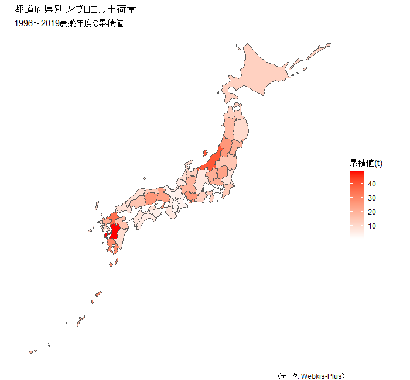
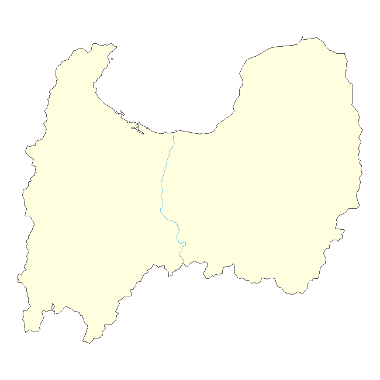
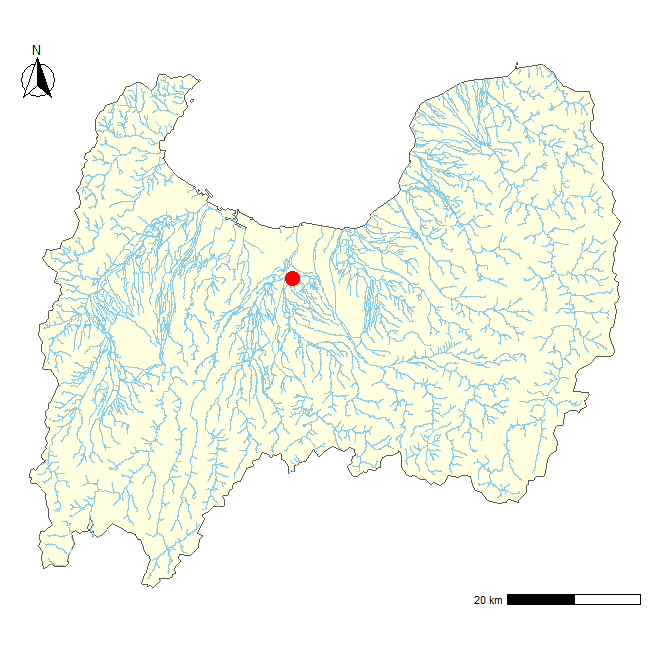

---  
##Rを使った地理情報データの可視化  
##なんでもできる！Rを使った環境データ解析事例  
##中西康介（国立環境研究所　環境リスク・健康領域）  
##2022/06/14  

---
```r
## パッケージの読み込み
#インストールしていない場合は、まずインストール（初回のみ）
install.packages(c("tidyverse", "sf", "rmapshaper", "mapview", "ggspatial"))

#{jpndistrict}は{remotes}をインストールした上で、GitHubからインストール（初回のみ）
install.packages("remotes")
remotes::install_github("uribo/jpndistrict")

#パッケージの読み込み
#2回目以降もRを立ち上げる度にまず実行
library(tidyverse)  #ggplot2、dplyr、purrrなどを含むパッケージ群
library(sf)  #RでGISを扱うための一連の機能
library(jpndistrict)  #日本の行政区の地図データ
library(rmapshaper)  #shapefileの単純化
library(mapview)  #インタラクティブな地図表示
library(ggspatial)  #スケールバー、方位記号の表示


## 日本地図の作成: 地図データの準備
#Shapefileのダウンロード（作業ディレクトリに保存される）
#ブラウザでのマウス操作でもOK（その場合、作業ディレクトリに解凍しておく）
download.file(
  "https://biogeo.ucdavis.edu/data/diva/adm/JPN_adm.zip",  #DIVA-GISより取得
  destfile = "JPN_adm.zip"
  )
#zipファイルの解凍
system("unzip JPN_adm.zip")

## 日本地図の作成: 白地図を描いてみる
#Shapefileの読み込み
#sf::はパッケージ名の指定（省略可）
jpn_0 <- sf::st_read("JPN_adm0.shp") %>%  #海岸線
  rmapshaper::ms_simplify(keep = 0.001, keep_shapes = TRUE)  #境界の単純化（1/1000の解像度）
jpn_1 <- sf::st_read("JPN_adm1.shp") %>%  #都道府県
  rmapshaper::ms_simplify(keep = 0.001, keep_shapes = TRUE)
jpn_2 <- sf::st_read("JPN_adm2.shp") %>%  #市区町村
  rmapshaper::ms_simplify(keep = 0.001, keep_shapes = TRUE)

#ggplotで作図
ggplot(jpn_0) +
  geom_sf()
```

```r
ggplot(jpn_1) +
  geom_sf()
```

```r
ggplot(jpn_2) +
  geom_sf()
```

```r
## 日本地図の作成: {jpndistrict}パッケージを使った方法
#都道府県を結合して日本地図をつくる
jpn_dist <- 1:47 %>%  #都道府県jisコード（1～47すべてに以下の処理を適用）
  purrr::map(  #繰り返し処理のための関数
    ~jpndistrict::jpn_pref(  #都道府県を抽出
      pref_code = .,  #都道府県コードを入れていく
      district = TRUE  #区市町村境界の表示あり, R ver.4.1以降ではdistrict=FALSEだとエラーが出る？
      )
    ) %>% 
  purrr::reduce(rbind) %>%  #上の処理を結合 
  rmapshaper::ms_simplify(keep = 0.001, keep_shapes = TRUE)  #境界の単純化（1/1000の解像度）

ggplot(jpn_dist) +
  geom_sf()
```

```r
## 座標参照系の確認と変換  
#座標系の確認
st_crs(jpn_dist)

#座標系の変換
jpn_dist_t <- st_transform(jpn_dist, 6677)　 #平面直角座標系（日本測地系JGD2011, IX系）へ

#異なる座標系の図示
#地理座標系(WGS84)
ggplot(jpn_dist) +
  geom_sf() +
  labs(title = "地理座標系（WGS84）")
```

```r  
#平面直角座標系(JGD2011, IX系)
ggplot(jpn_dist_t) +
  geom_sf() +
  labs(title = "平面直角座標系（JGD2011）")
```


```r
## データの可視化  
#都道府県別農薬出荷量（フィプロニル: 1996～2019農薬年度）
#農薬データの読み込み
#Webkis-Plus <https://www.nies.go.jp/kisplus/> より取得したフィプロニルの合計出荷量データ
fipronil <- data.frame(
  pref_code = as.character(c(1:47)),  #jpn_distに合わせてpref_codeを文字列に変換
  fipronil = c(12.42, 12.76, 9.93, 20.24, 17.72, 26.24, 15.07, 7.17, 23.89, 20.69, 20.69, 14.18, 0.88, 1.16, 39.71, 12.66, 9.18, 6.06, 1.41, 6.82, 19.7, 12.78, 26.52, 3.77, 4.77, 3.84, 5.5, 23.92, 3.35, 6.86, 13.69, 8.54, 26.48, 15.43, 8.08, 4.76, 8.17, 6.99, 5.81, 34.99, 20.78, 10.31, 48.59, 16.13, 9.19, 28.78, 18.36)
  )
#データの確認
head(fipronil, n = 3)  #先頭3行を表示
```
  pref_code fipronil  
1         1    12.42  
2         2    12.76  
3         3     9.93  
```r
#フィプロニルの都道府県別合計出荷量の可視化
ggplot(fipronil_map) +
  geom_sf(aes(fill = fipronil)) +
  scale_fill_continuous(
    "累積値(t)",  #凡例タイトル
    low = "white",  #下限値の色
    high = "red"  #上限値の色
    ) +
  labs(
    title = "都道府県別フィプロニル出荷量",
    subtitle = "1996～2019農薬年度の累積値",
    caption = "（データ: Webkis-Plus）"
    ) +
  theme_void()  #軸やグリッド線をなくしたデザイン
```



```r
## 富山県の河川図をつくる
#データの準備 
#富山県の地図
tym <- jpndistrict::jpn_pref(pref_code = 16, district = TRUE) %>% 
  rmapshaper::ms_simplify(keep = 0.1, keep_shapes = TRUE)  #境界の単純化（1/10の解像度）

#富山県の河川
#国土数値情報ダウンロードサービスからダウンロードして解凍
download.file(
  "https://nlftp.mlit.go.jp/ksj/gml/data/W05/W05-07/W05-07_16_GML.zip",
  destfile = "W05-07_16_GML.zip"
  )
system("unzip W05-07_16_GML.zip")

#解凍したshapefileの読み込み
tym_stream <- sf::st_read(
  "W05-07_16-g_Stream.shp",  #解凍したshapefile名
  crs = 4326  #座標系の指定
  )

#富山の地図に河川図を重ねる
ggplot() +
  geom_sf(
    data = tym,  #データの指定
    fill = "lightyellow"  #塗りつぶしの色の指定
    ) +
  geom_sf(
    data = tym_stream,
    colour = "skyblue"  #線の色の指定
    ) +
  theme_void()  #軸やグリッド線をなくしたデザイン
```

```r
#特定の河川のみ表示する
#神通川のみ表示
ggplot() +
  geom_sf(
    data = tym,
    fill = "lightyellow"
    ) +
  geom_sf(
    data = tym_stream %>%
      dplyr::filter(W05_004 == "神通川"),  #河川の指定
    colour = "skyblue"
    ) +
  theme_void()
```

```r
#地図装飾を加える
ggplot() +
  geom_sf(data = tym, fill = "lightyellow") +
  geom_sf(data = tym_stream, colour = "skyblue") +
  theme_void() +
  #スケールバーの追加
  ggspatial::annotation_scale(
    location = "br"  #追加する位置（右下, bottom right）
    ) +
  #方位記号の追加
  ggspatial::annotation_north_arrow(
    location = "tl",  #左上, top left
    style = north_arrow_fancy_orienteering()  #記号の種類
    ) +
  #富山国際会議場のポイントを追加
  geom_point(
    aes(x = 137.21097239986847, y = 36.69155439658318),
    colour = "red", size = 5
    )
```

```r
## インタラクティブな地図で表示  
#{mapview}を使用  
mapview(tym) +
  mapview(tym_stream) +
  mapview(
    sf::st_point(c(137.21097239986847, 36.69155439658318)),
    color = "red", col.regions = "red"
    )
```
##参考サイト
#- Rを使った地理空間データの可視化    
#<https://tsukubar.github.io/r-spatial-guide/introduction.html>  
#- cucumber flesh（{jpndistrict}の開発者、瓜生さんのblog）  
#<https://uribo.hatenablog.com/>  
#- Rを用いたGIS（株式会社エコリス 水谷さんの公開資料）  
#<https://tmizu23.github.io/R_GIS_tutorial/R_GIS_tutorial2018.9.3.html>  
#- Geocomputation with R  
#<https://geocompr.robinlovelace.net/>  

