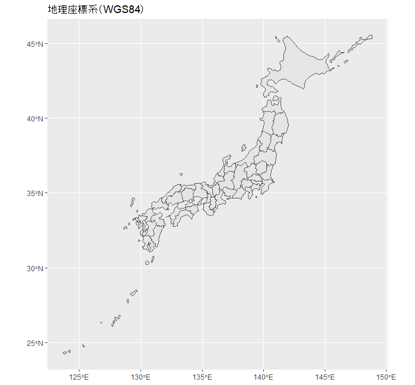

---  
##Rを使った地理情報データの可視化  
##なんでもできる！Rを使った環境データ解析事例  
##中西康介（国立環境研究所　環境リスク・健康領域）  
##2022/06/14  

---
```r
## パッケージの読み込み
#インストールしていない場合は、まずインストール（初回のみ）
install.packages(c("tidyverse", "sf", "rmapshaper", "mapview", "ggspatial"))

#{jpndistrict}は{remotes}をインストールした上で、GitHubからインストール（初回のみ）
install.packages("remotes")
remotes::install_github("uribo/jpndistrict")

#パッケージの読み込み
#2回目以降もRを立ち上げる度にまず実行
library(tidyverse)  #ggplot2、dplyr、purrrなどを含むパッケージ群
library(sf)  #RでGISを扱うための一連の機能
library(jpndistrict)  #日本の行政区の地図データ
library(rmapshaper)  #shapefileの単純化
library(mapview)  #インタラクティブな地図表示
library(ggspatial)  #スケールバー、方位記号の表示


## 日本地図の作成: 地図データの準備
#Shapefileのダウンロード（作業ディレクトリに保存される）
#ブラウザでのマウス操作でもOK（その場合、作業ディレクトリに解凍しておく）
download.file(
  "https://biogeo.ucdavis.edu/data/diva/adm/JPN_adm.zip",  #DIVA-GISより取得
  destfile = "JPN_adm.zip"
  )
#zipファイルの解凍
system("unzip JPN_adm.zip")

## 日本地図の作成: 白地図を描いてみる
#Shapefileの読み込み
#sf::はパッケージ名の指定（省略可）
jpn_0 <- sf::st_read("JPN_adm0.shp") %>%  #海岸線
  rmapshaper::ms_simplify(keep = 0.001, keep_shapes = TRUE)  #境界の単純化（1/1000の解像度）
jpn_1 <- sf::st_read("JPN_adm1.shp") %>%  #都道府県
  rmapshaper::ms_simplify(keep = 0.001, keep_shapes = TRUE)
jpn_2 <- sf::st_read("JPN_adm2.shp") %>%  #市区町村
  rmapshaper::ms_simplify(keep = 0.001, keep_shapes = TRUE)

#ggplotで作図
ggplot(jpn_0) +
  geom_sf()
```

```r
ggplot(jpn_1) +
  geom_sf()
```

```r
ggplot(jpn_2) +
  geom_sf()
```

```r
## 日本地図の作成: {jpndistrict}パッケージを使った方法
#都道府県を結合して日本地図をつくる
jpn_dist <- 1:47 %>%  #都道府県jisコード（1～47すべてに以下の処理を適用）
  purrr::map(  #繰り返し処理のための関数
    ~jpndistrict::jpn_pref(  #都道府県を抽出
      pref_code = .,  #都道府県コードを入れていく
      district = TRUE  #区市町村境界の表示あり
      )
    ) %>% 
  purrr::reduce(rbind) %>%  #上の処理を結合 
  rmapshaper::ms_simplify(keep = 0.001, keep_shapes = TRUE)  #境界の単純化（1/1000の解像度）

ggplot(jpn_dist) +
  geom_sf()
```

```r
## 座標参照系の確認と変換  
#座標系の確認
st_crs(jpn_dist)

#座標系の変換
jpn_dist_t <- st_transform(jpn_dist, 6677)　 #平面直角座標系（日本測地系JGD2011, IX系）へ

#異なる座標系の図示
#地理座標系(WGS84)
ggplot(jpn_dist) +
  geom_sf() +
  labs(title = "地理座標系（WGS84）")
```

```r  
#平面直角座標系(JGD2011, IX系)
ggplot(jpn_dist_t) +
  geom_sf() +
  labs(title = "平面直角座標系（JGD2011）")
```


```r
## データの可視化  
#都道府県別農薬出荷量（フィプロニル: 1996～2019農薬年度）
#農薬データの読み込み
#Webkis-Plus <https://www.nies.go.jp/kisplus/> より取得したフィプロニルの合計出荷量データ
fipronil <- data.frame(
  pref_code = as.character(c(1:47)),  #jpn_distに合わせてpref_codeを文字列に変換
  fipronil = c(12.42, 12.76, 9.93, 20.24, 17.72, 26.24, 15.07, 7.17, 23.89, 20.69, 20.69, 14.18, 0.88, 1.16, 39.71, 12.66, 9.18, 6.06, 1.41, 6.82, 19.7, 12.78, 26.52, 3.77, 4.77, 3.84, 5.5, 23.92, 3.35, 6.86, 13.69, 8.54, 26.48, 15.43, 8.08, 4.76, 8.17, 6.99, 5.81, 34.99, 20.78, 10.31, 48.59, 16.13, 9.19, 28.78, 18.36)
  )
#データの確認
head(fipronil, n = 3)  #先頭3行を表示
```
  pref_code fipronil  
1         1    12.42  
2         2    12.76  
3         3     9.93  
```r
#フィプロニルの都道府県別合計出荷量の可視化
ggplot(fipronil_map) +
  geom_sf(aes(fill = fipronil)) +
  scale_fill_continuous(
    "累積値(t)",  #凡例タイトル
    low = "white",  #下限値の色
    high = "red"  #上限値の色
    ) +
  labs(
    title = "都道府県別フィプロニル出荷量",
    subtitle = "1996～2019農薬年度の累積値",
    caption = "（データ: Webkis-Plus）"
    ) +
  theme_void()  #軸やグリッド線をなくしたデザイン
```


```r
## 富山県の河川図をつくる
#データの準備 
#富山県の地図
tym <- jpndistrict::jpn_pref(pref_code = 16, district = TRUE) %>% 
  rmapshaper::ms_simplify(keep = 0.1, keep_shapes = TRUE)  #境界の単純化（1/10の解像度）

#富山県の河川
#国土数値情報ダウンロードサービスからダウンロードして解凍
download.file(
  "https://nlftp.mlit.go.jp/ksj/gml/data/W05/W05-07/W05-07_16_GML.zip",
  destfile = "W05-07_16_GML.zip"
  )
system("unzip W05-07_16_GML.zip")

#解凍したshapefileの読み込み
tym_stream <- sf::st_read(
  "W05-07_16-g_Stream.shp",  #解凍したshapefile名
  crs = 4326  #座標系の指定
  )

#富山の地図に河川図を重ねる
ggplot() +
  geom_sf(
    data = tym,  #データの指定
    fill = "lightyellow"  #塗りつぶしの色の指定
    ) +
  geom_sf(
    data = tym_stream,
    colour = "skyblue"  #線の色の指定
    ) +
  theme_void()  #軸やグリッド線をなくしたデザイン
```

```r
#特定の河川のみ表示する
#神通川のみ表示
ggplot() +
  geom_sf(
    data = tym,
    fill = "lightyellow"
    ) +
  geom_sf(
    data = tym_stream %>%
      dplyr::filter(W05_004 == "神通川"),  #河川の指定
    colour = "skyblue"
    ) +
  theme_void()
```

```r
#地図装飾を加える
ggplot() +
  geom_sf(data = tym, fill = "lightyellow") +
  geom_sf(data = tym_stream, colour = "skyblue") +
  theme_void() +
  #スケールバーの追加
  ggspatial::annotation_scale(
    location = "br"  #追加する位置（右下, bottom right）
    ) +
  #方位記号の追加
  ggspatial::annotation_north_arrow(
    location = "tl",  #左上, top left
    style = north_arrow_fancy_orienteering()  #記号の種類
    ) +
  #富山国際会議場のポイントを追加
  geom_point(
    aes(x = 137.21097239986847, y = 36.69155439658318),
    colour = "red", size = 5
    )
```

```r
## インタラクティブな地図で表示  
#{mapview}を使用  
mapview(tym) +
  mapview(tym_stream) +
  mapview(
    sf::st_point(c(137.21097239986847, 36.69155439658318)),
    color = "red", col.regions = "red"
    )
```
##参考サイト
#- Rを使った地理空間データの可視化    
#<https://tsukubar.github.io/r-spatial-guide/introduction.html>  
#- cucumber flesh（{jpndistrict}の開発者、瓜生さんのblog）  
#<https://uribo.hatenablog.com/>  
#- Rを用いたGIS（株式会社エコリス 水谷さんの公開資料）  
#<https://tmizu23.github.io/R_GIS_tutorial/R_GIS_tutorial2018.9.3.html>  
#- Geocomputation with R  
#<https://geocompr.robinlovelace.net/>  


##実行環境
#--- Session info ---
#setting  value                       
#version  R version 4.0.2 (2020-06-22)
#os       Windows 10 x64              
#system   x86_64, mingw32             
#ui       RStudio                     
#language (EN)                        
#collate  Japanese_Japan.932          
#ctype    Japanese_Japan.932          
#tz       Asia/Tokyo                  
#date     2022-06-07                  

#--- Packages ---
#package         * version    date       lib source                            
#assertthat        0.2.1      2019-03-21 [1] CRAN (R 4.0.2)                    
#backports         1.1.7      2020-05-13 [1] CRAN (R 4.0.0)                    
#base64enc         0.1-3      2015-07-28 [1] CRAN (R 4.0.0)                    
#blob              1.2.1      2020-01-20 [1] CRAN (R 4.0.2)                    
#broom             0.7.12     2022-01-28 [1] CRAN (R 4.0.5)                    
#cellranger        1.1.0      2016-07-27 [1] CRAN (R 4.0.2)                    
#class             7.3-17     2020-04-26 [2] CRAN (R 4.0.2)                    
#classInt          0.4-3      2020-04-07 [1] CRAN (R 4.0.3)                    
#cli               3.1.0      2021-10-27 [1] CRAN (R 4.0.5)                    
#codetools         0.2-16     2018-12-24 [2] CRAN (R 4.0.2)                    
#colorspace        1.4-1      2019-03-18 [1] CRAN (R 4.0.3)                    
#crayon            1.3.4      2017-09-16 [1] CRAN (R 4.0.2)                    
#crosstalk         1.1.0.1    2020-03-13 [1] CRAN (R 4.0.3)                    
#crul              1.2.0      2021-11-22 [1] CRAN (R 4.0.5)                    
#curl              4.3        2019-12-02 [1] CRAN (R 4.0.2)                    
#DBI               1.1.0      2019-12-15 [1] CRAN (R 4.0.2)                    
#dbplyr            1.4.4      2020-05-27 [1] CRAN (R 4.0.2)                    
#digest            0.6.25     2020-02-23 [1] CRAN (R 4.0.2)                    
#dplyr           * 1.0.7      2021-06-18 [1] CRAN (R 4.0.5)                    
#e1071             1.7-4      2020-10-14 [1] CRAN (R 4.0.3)                    
#ellipsis          0.3.2      2021-04-29 [1] CRAN (R 4.0.5)                    
#evaluate          0.14       2019-05-28 [1] CRAN (R 4.0.2)                    
#fansi             0.4.1      2020-01-08 [1] CRAN (R 4.0.2)                    
#farver            2.0.3      2020-01-16 [1] CRAN (R 4.0.2)                    
#fastmap           1.1.0      2021-01-25 [1] CRAN (R 4.0.5)                    
#forcats         * 0.5.0      2020-03-01 [1] CRAN (R 4.0.2)                    
#foreign           0.8-80     2020-05-24 [2] CRAN (R 4.0.2)                    
#fs                1.5.0      2020-07-31 [1] CRAN (R 4.0.2)                    
#generics          0.1.0      2020-10-31 [1] CRAN (R 4.0.3)                    
#geojson           0.3.4      2020-06-23 [1] CRAN (R 4.0.5)                    
#geojsonio         0.9.4      2021-01-13 [1] CRAN (R 4.0.5)                    
#geojsonlint       0.4.0      2020-02-13 [1] CRAN (R 4.0.5)                    
#geojsonsf         2.0.3      2022-05-30 [1] CRAN (R 4.0.2)                    
#ggplot2         * 3.3.5      2021-06-25 [1] CRAN (R 4.0.5)                    
#ggspatial       * 1.1.5      2021-01-04 [1] CRAN (R 4.0.5)                    
#glue              1.4.1      2020-05-13 [1] CRAN (R 4.0.2)                    
#googlePolylines   0.8.2      2020-12-15 [1] CRAN (R 4.0.5)                    
#gtable            0.3.0      2019-03-25 [1] CRAN (R 4.0.2)                    
#haven             2.4.3      2021-08-04 [1] CRAN (R 4.0.5)                    
#hms               0.5.3      2020-01-08 [1] CRAN (R 4.0.2)                    
#htmltools         0.5.2      2021-08-25 [1] CRAN (R 4.0.5)                    
#htmlwidgets       1.5.2      2020-10-03 [1] CRAN (R 4.0.3)                    
#httpcode          0.3.0      2020-04-10 [1] CRAN (R 4.0.5)                    
#httpuv            1.5.4      2020-06-06 [1] CRAN (R 4.0.3)                    
#httr              1.4.2      2020-07-20 [1] CRAN (R 4.0.2)                    
#jpndistrict     * 0.3.9.9000 2021-06-18 [1] Github (uribo/jpndistrict@064b46e)
#jqr               1.2.3      2022-03-10 [1] CRAN (R 4.0.5)                    
#jsonlite          1.7.3      2022-01-17 [1] CRAN (R 4.0.2)                    
#jsonvalidate      1.3.2      2021-11-03 [1] CRAN (R 4.0.5)                    
#KernSmooth        2.23-17    2020-04-26 [2] CRAN (R 4.0.2)                    
#knitr             1.37       2021-12-16 [1] CRAN (R 4.0.5)                    
#later             1.1.0.1    2020-06-05 [1] CRAN (R 4.0.3)                    
#lattice           0.20-41    2020-04-02 [2] CRAN (R 4.0.2)                    
#lazyeval          0.2.2      2019-03-15 [1] CRAN (R 4.0.3)                    
#leafem            0.1.3      2020-07-26 [1] CRAN (R 4.0.3)                    
#leaflet           2.0.3      2019-11-16 [1] CRAN (R 4.0.3)                    
#lifecycle         1.0.1      2021-09-24 [1] CRAN (R 4.0.5)                    
#lubridate         1.7.9      2020-06-08 [1] CRAN (R 4.0.2)                    
#magrittr          2.0.1      2020-11-17 [1] CRAN (R 4.0.3)                    
#maptools          1.0-2      2020-08-24 [1] CRAN (R 4.0.3)                    
#mapview         * 2.9.0      2020-08-11 [1] CRAN (R 4.0.3)                    
#memoise           1.1.0      2017-04-21 [1] CRAN (R 4.0.3)                    
#mime              0.9        2020-02-04 [1] CRAN (R 4.0.0)                    
#miniUI            0.1.1.1    2018-05-18 [1] CRAN (R 4.0.5)                    
#modelr            0.1.8      2020-05-19 [1] CRAN (R 4.0.2)                    
#munsell           0.5.0      2018-06-12 [1] CRAN (R 4.0.2)                    
#pillar            1.6.4      2021-10-18 [1] CRAN (R 4.0.5)                    
#pkgconfig         2.0.3      2019-09-22 [1] CRAN (R 4.0.2)                    
#png               0.1-7      2013-12-03 [1] CRAN (R 4.0.3)                    
#promises          1.1.1      2020-06-09 [1] CRAN (R 4.0.3)                    
#purrr           * 0.3.4      2020-04-17 [1] CRAN (R 4.0.2)                    
#R6                2.4.1      2019-11-12 [1] CRAN (R 4.0.2)                    
#raster            3.3-13     2020-07-17 [1] CRAN (R 4.0.3)                    
#Rcpp              1.0.8      2022-01-13 [1] CRAN (R 4.0.5)                    
#readr           * 2.1.2      2022-01-30 [1] CRAN (R 4.0.5)                    
#readxl            1.3.1      2019-03-13 [1] CRAN (R 4.0.2)                    
#reprex            0.3.0      2019-05-16 [1] CRAN (R 4.0.2)                    
#rgeos             0.5-9      2021-12-15 [1] CRAN (R 4.0.5)                    
#rlang             0.4.12     2021-10-18 [1] CRAN (R 4.0.5)                    
#rmapshaper      * 0.4.6      2022-05-10 [1] CRAN (R 4.0.2)                    
#rmarkdown         2.14       2022-04-25 [1] CRAN (R 4.0.2)                    
#rsconnect         0.8.18     2021-05-24 [1] CRAN (R 4.0.5)                    
#rstudioapi        0.13       2020-11-12 [1] CRAN (R 4.0.5)                    
#rvest             0.3.6      2020-07-25 [1] CRAN (R 4.0.2)                    
#satellite         1.0.2      2019-12-09 [1] CRAN (R 4.0.3)                    
#scales            1.1.1      2020-05-11 [1] CRAN (R 4.0.3)                    
#sessioninfo       1.1.1      2018-11-05 [1] CRAN (R 4.0.3)                    
#sf              * 0.9-6      2020-09-13 [1] CRAN (R 4.0.3)                    
#shiny             1.5.0      2020-06-23 [1] CRAN (R 4.0.3)                    
#sp                1.4-4      2020-10-07 [1] CRAN (R 4.0.3)                    
#stringi           1.4.6      2020-02-17 [1] CRAN (R 4.0.0)                    
#stringr         * 1.4.0      2019-02-10 [1] CRAN (R 4.0.2)                    
#tibble          * 3.0.3      2020-07-10 [1] CRAN (R 4.0.2)                    
#tidyr           * 1.1.2      2020-08-27 [1] CRAN (R 4.0.3)                    
#tidyselect        1.1.0      2020-05-11 [1] CRAN (R 4.0.2)                    
#tidyverse       * 1.3.0      2019-11-21 [1] CRAN (R 4.0.3)                    
#tzdb              0.3.0      2022-03-28 [1] CRAN (R 4.0.5)                    
#units             0.6-7      2020-06-13 [1] CRAN (R 4.0.3)                    
#utf8              1.1.4      2018-05-24 [1] CRAN (R 4.0.2)                    
#V8                4.2.0      2022-05-14 [1] CRAN (R 4.0.2)                    
#vctrs             0.3.8      2021-04-29 [1] CRAN (R 4.0.5)                    
#webshot           0.5.2      2019-11-22 [1] CRAN (R 4.0.3)                    
#withr             2.2.0      2020-04-20 [1] CRAN (R 4.0.2)                    
#xfun              0.29       2021-12-14 [1] CRAN (R 4.0.5)                    
#xml2              1.3.2      2020-04-23 [1] CRAN (R 4.0.2)                    
#xtable            1.8-4      2019-04-21 [1] CRAN (R 4.0.3)                    
#yaml              2.2.1      2020-02-01 [1] CRAN (R 4.0.2)    
