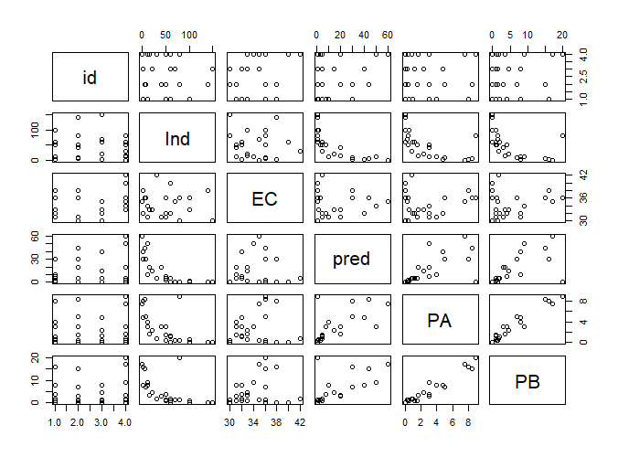

---
##環境化学物質 3 学会合同大会 自由集会2　2022.6.14  
##なんでもできる！Rを使った環境データ解析事例  
##GLMM（一般化線形混合モデル）でデータのばらつきに対応しよう！    
##一般財団法人残留農薬研究所 石母田　誠  
##使用ソフト：統計ソフトR ver. 4.1.0  

---
  

``` r
####メソコスム試験（ダミーデータ）GLM解析###    
toxicity<-read.table("GLMM-data.Ishimota.txt", header = T)	#データの読み込み
attach(toxicity)　　　　　　　　　　　　　　　　　　　　#データへのアクセス
pairs(toxicity)　　　　　　　　　　　　　　　　         #変数同士の関係性の図示
``` 

``` r
mode1 <-glm(Ind~EC+pred+PA+PB,family=poisson(link="log"),data=toxicity) 

summary(mode1)

```
Call:  
glm(formula = Ind ~ EC + pred + PA + PB, family = poisson(link = "log"),   
    data = toxicity)  
  
Deviance Residuals:   
   Min      1Q  Median      3Q     Max    
-5.941  -1.936  -1.000   1.584   5.934    
    
Coefficients:  
              Estimate Std. Error z value Pr(>|z|)      
(Intercept)  5.656e+00  3.063e-01  18.465  < 2e-16 ***  
EC          -3.108e-02  8.893e-03  -3.495 0.000475 ***  
pred        -8.083e-02  6.004e-03 -13.462  < 2e-16 ***  
PA          -3.676e-02  7.444e-02  -0.494 0.621492      
PB           1.101e-05  3.358e-02   0.000 0.999738      
   
Signif. codes:  0 ‘***’ 0.001 ‘**’ 0.01 ‘*’ 0.05 ‘.’ 0.1 ‘ ’ 1  
  
(Dispersion parameter for poisson family taken to be 1)   
    Null deviance: 917.52  on 23  degrees of freedom  
Residual deviance: 186.23  on 19  degrees of freedom  #残差逸脱度(186.23),残差自由度（19）
AIC: 316.87  
  
Number of Fisher Scoring iterations: 5  
  
  
``` r
x2<-sum(residuals(mode1, type="pearson")^2)         　　　　#ピアソンのχ二乗統計量


x2/19         　　　　#ピアソンのχ二乗統計量(x2)/残差自由度（19）：dispersion parameter  
```
[1] 11.14842  

``` r
####メソコスム試験（ダミーデータ）GLMM解析###
install.packages("lme4")                                    #lme4パッケージのインストール（お持ちの場合は割愛）

toxicity<-read.table("GLMM-data.Ishimota.txt", header = T)　#データの読み込み
attach(toxicity)

library(lme4)                                   　　　　#lme4のパッケージの読み込み

mode2 <-glmer(Ind~EC+pred+PA+PB+(1|id) ,family=poisson(link="log"),data=toxicity)    　　　　 #GLMM解析， +(1|id)：切片にランダム効果を追加

summary(mode2)
``` 
Generalized linear mixed model fit by maximum likelihood (Laplace Approximation) ['glmerMod']  
 Family: poisson  ( log )  
Formula: Ind ~ EC + pred + PA + PB + (1 | id)  
   Data: toxicity  
  
   AIC      BIC   logLik deviance df.resid   
   310.7    317.8   -149.4    298.7       18   
  
Scaled residuals:   
    Min      1Q  Median      3Q     Max   
-4.7805 -1.8406 -0.6005  1.6779  7.0388   
  
Random effects:  
 Groups Name        Variance Std.Dev.  
 id     (Intercept) 0.02383  0.1544    
Number of obs: 24, groups:  id, 4  
  
Fixed effects:  
            Estimate Std. Error z value Pr(>|z|)      
(Intercept)  4.89741    0.41821  11.710   <2e-16 ***  
EC          -0.00963    0.01179  -0.817    0.414      
pred        -0.07976    0.00601 -13.270   <2e-16 ***  
PA          -0.07966    0.07713  -1.033    0.302      
PB           0.02920    0.03537   0.826    0.409      
   
Signif. codes:  0 ‘***’ 0.001 ‘**’ 0.01 ‘*’ 0.05 ‘.’ 0.1 ‘ ’ 1  
  
Correlation of Fixed Effects:  
     (Intr) EC     pred   PA      
EC   -0.979                       
pred -0.007 -0.026                
PA   -0.085  0.093 -0.576         
PB    0.021 -0.035  0.515 -0.978  
