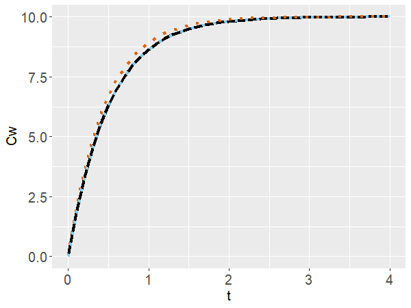
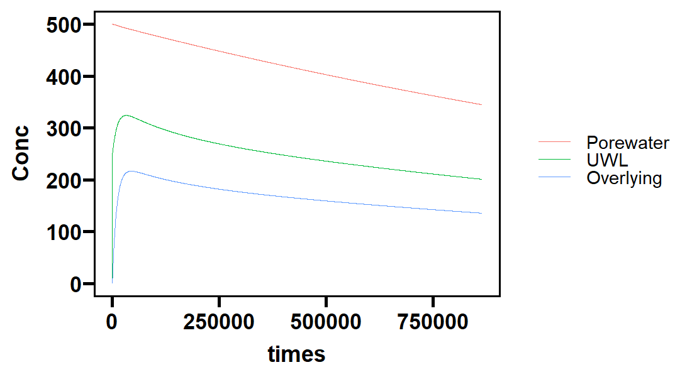
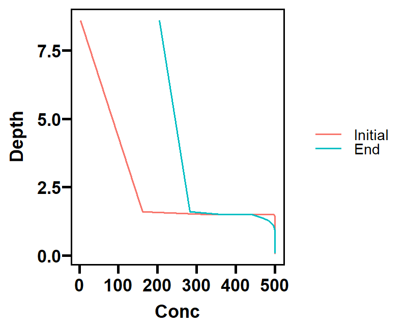

---
##環境化学物質 3 学会合同大会 自由集会2　2022.6.14  
##なんでもできる！Rを使った環境データ解析事例  
##Rで微分方程式を解く～移流拡散方程式の例～  
##日置恭史郎　国立環境研究所 環境リスク・健康領域 　
  
---

```r
######## 簡易モデル：底泥からの脱着 #######
# パッケージのインストール
library(ReacTran) #deSolveも一緒にダウンロードされる
library(ggplot2)
library(ggprism)
library(tidyverse)

# パラメータと初期値の設定
parameters <- c(Ceq = 10, k =2)  #パラメータの値
state <- c(Cw = 0)     ## 変数の初期値
t <- seq(0,4,0.1)

# 解析解
kinetics_anal <- function(t){-parameters["Ceq"]*(1-exp(parameters["k"]*t))/exp(parameters["k"]*t)}

# 数値解析
kinetics_num <- function(t,state, parameters) {
	with(as.list(c(state, parameters)), {
		dCw <- k * (Ceq - Cw)
		list(c(dCw))
	})
}

out_euler <- ode(y = state, times = t, func = kinetics_num, parms = parameters, method="euler") %>%　#オイラー法
  as.data.frame()
out_rk <- ode(y = state, times = t, func = kinetics_num, parms = parameters, method="rk4") %>% #ルンゲクッタ法
  as.data.frame()

head(out_euler)   #計算結果の確認
```
  time     Cw  
1  0.0 0.0000  
2  0.1 2.0000  
3  0.2 3.6000  
4  0.3 4.8800  
5  0.4 5.9040  
6  0.5 6.7232  
```r
# まとめて図示
ggplot()+
  geom_line(aes(x=t,y=kinetics_anal(t)),lwd=1.5) +
  geom_line(data=out_euler,aes(x=time,y=Cw),col="chocolate",lwd=1.5, lty="dotted") +
  geom_line(data=out_rk,aes(x=time,y=Cw),col="skyblue",lwd=1.5, lty=3)+
  labs(y="Cw")
```



```r
######## 少し複雑なモデル #######
## Section 1: グリッドを設定する##
vol_w = 200       # 上層水の容量 (cm3)
x_sed = 1.5       # 底泥 (cm)
x_UWL = 0.1       # 非攪拌層（UWL) (cm)
x_overwater = 7   # 完全混合の上層水の深さ (cm)
Length <- c(x_sed,  x_UWL, x_overwater)

# レイヤーの数を設定する
N_sed = 20        
N_UWL = 100      
N_overwater = 1 
N_total = N_sed+N_UWL+N_overwater

# モデルのグリッドに当てはめる
Num <- c(N_sed,  N_UWL, N_overwater)

# グリッドを設定する
grid <- setup.grid.1D(x.up = 0, L = Length, N = Num)

# 各ボックスの位置を定義する
compIntIdx <- c(1, cumsum(Num)+1)          # Vector indices of the cell interfaces
iR <- tail(head(compIntIdx, -1), -1)     # Position of cells
iL <- iR - 1                             # Position of cells

# 境界層のフラックス計算のためにボックスのサイズを計算
r <- grid$dx[iL]/grid$dx[iR]


## Section 2: パラメータを設定する ###
K_oc = 10^4               # 有機物質-水の分配係数 (L_w/kg_oc)
f_oc = 0.02               # 底泥中の有機物質含有量 (kg_oc/kg_sed)
K_sedw = f_oc * K_oc      # 底泥-水の分配係数 (L_w/kg_sed)
C_sediment0 = 100         # 底泥中の初期物質濃度 (mg/kg_sed)

water_flow = vol_w*4/(24*60*60)             # 換水速度 (cm3/s)
flux_out_w = water_flow / vol_w             # 換水速度 (1/s)
D_overwater = 7E-06                         # 拡散係数(cm2/s)
D_UWL = 1E-04                               # 非攪拌層での拡散係数 (cm2/s)
por = 0.49                                  # 底泥中の水の割合
tort = 1 - log(por^2)                       # Tortuosity factor
rho_sed = 1.68                              # 底泥の密度 (kg_sed/L_w)
D_sed = por/tort * (D_overwater )           # 底泥中の拡散係数 (cm2/s)

# 個々のコンパートメントは異なる拡散係数（cm2/s）を有する
Diff <- c(D_sed, D_UWL, D_overwater)
D <- rep(Diff, times=Num)
D[compIntIdx] <- 0

# 個々のコンパートメントは異なる分配係数を有する
K <- c( K_sedw,1, 1)

# 系外への流出を定義する
water_outflux <- c(0, 0,  flux_out_w)
flux.out <- rep(water_outflux, times=Num) 

# 初期濃度を入力する
yini <- rep(0, grid$N)                        # 初期濃度をすべて0にする
yini[1:(N_sed)] <- C_sediment0      # 初期底泥濃度のみ入力
iF <- 1:grid$N                      # grid ID

# 時間軸を設定する
test_duration = 10 * (60*60*24)                        # 単位：秒、期間：10日間
times <- seq(from = 0, to = test_duration, by = 200)   # タイムステップ


#### Section 3: モデル定義と数値解析 ####
# 拡散方程式はtran.1D関数で定義する
sediment.model <- function (t, y, pars = NULL) {
  C_free <- y[iF]
  # Change in concentration due to diffusion
  dC_freedt <- tran.1D(C_free, flux.up = 0, flux.down = 0, 
                  D = D, dx = grid, full.check = TRUE)$dC
  # Add outflux due to water ventilation
  dC_freedt <- dC_freedt - C_free * flux.out      #換水による希釈
  # Change in concentration due to boundary condition
  dC_free_L <- K / (1 + r * K) * (C_free[iR]) - 1 / (1 + r * K) * (C_free[iL])
  dC_free_R <- - r * dC_free_L
  # Combine together
  dC_freedt[iL] <- dC_freedt[iL] + dC_free_L
  dC_freedt[iR] <- dC_freedt[iR] + dC_free_R
  print(c(min(C_free)))
        return(list(dC_freedt))
}


# ode.1D関数で微分方程式を解く
result <- ode.1D(y = yini, times = times, func = sediment.model, parms = 0, hini = 1,
              method = "vode", nspec = 1)


## Section 4: 経時変化と空間分布をプロットする ##
# まずは経時変化
Overlying <- result[,N_total+1]*1000    #1000: mg/L -> ug/L
Porewater <- rowMeans(result[,2:(N_sed)])/K_sedw*1000 # 局所的な平衡を仮定
UWL <- rowMeans(result[,(N_sed+2):(N_sed+N_UWL)])*1000
result_conc_time <- data.frame(times, Porewater, UWL, Overlying)

result_conc_time %>% 
  pivot_longer(cols=2:4,names_to="Type",values_to="Conc") %>%
  mutate_at(vars(Type),as.factor) %>%
  mutate(Type=fct_relevel(Type,"Porewater","UWL")) %>%
  ggplot () +
  geom_line(aes(x=times,y=Conc,col=Type))+
  theme_prism(border=TRUE,base_size=27)
```

```r
# 次に空間分布
Initial <- c(result[2,2:(N_sed+1)]/K_sedw,  result[2,(N_sed+2):(N_total+1)] )*1000
End <-  c(result[N_total+1,2:(N_sed+1)]/K_sedw,  result[N_total+1,(N_sed+2):(N_total+1)] )*1000
spatial_conc <- data.frame(Depth=grid$x.int[-1],Initial,End)

spatial_conc %>%
  pivot_longer(cols=2:3,names_to="Time",values_to="Conc") %>%
  mutate_at(vars(Time),as.factor) %>%
  mutate(Time=fct_relevel(Time,"Initial","End")) %>%
  ggplot () +
  geom_line(aes(x=Conc,y=Depth,col=Time))+
  theme_prism(border=TRUE,base_size=27)
```

