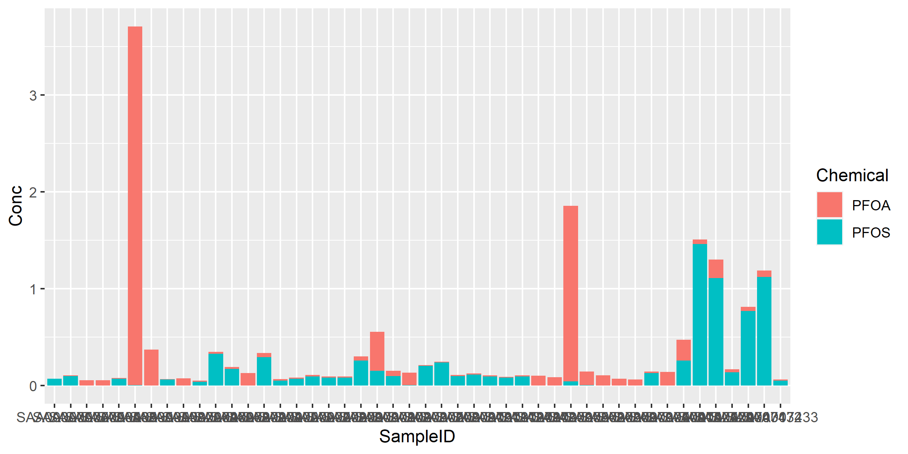

``` r
library(tidyverse)

#ChemTHEATRE (https://chem-theatre.com)
#ChemTHEATREからのデータのダウンロード方法は，以下に記載。https://qiita.com/kein613/items/3f00958f3491c9248fff
#ファイル名はダウンロード日時に依存します。
sample_data <- read.csv("samples_20220608004554.tsv", header = T, sep = "\t")   # "invalid multibyte string at .."のエラーが出たらfileEncoding = "UTF-8-BOM"を追加する

#データをシンプルにするのに，列を選択してます。
samples <- select(sample_data, SampleID, CollectionYear, CollectionLatitudeFrom, CollectionLongitudeFrom)
View(samples)
meas_data <- read.csv("measureddata_20220608004556.tsv", header = T, sep = "\t")  # "invalid multibyte string at .."のエラーが出たらfileEncoding = "UTF-8-BOM"を追加する
View(meas_data)

#PFOSとPFOAのデータだけを抽出。
#各濃度データに対してサンプル情報を付加。
conc <- meas_data %>% filter(ChemicalName == "PFOS" | ChemicalName == "PFOA")
View(conc)
joined <- left_join(conc, samples, by = "SampleID")
View(joined)

#テーブルを縦持ちから横持ちにして，PFOSとPFOAの濃度の和を計算。
dat <- joined %>%
  pivot_wider(id_cols = c(SampleID, CollectionLatitudeFrom, CollectionLongitudeFrom), names_from = ChemicalName, values_from = MeasuredValue)
dat1 <- dat %>%
  mutate(sum_PFC = select(., c("PFOS", "PFOA")) %>% rowSums(na.rm = TRUE))
View(dat1)

#PFOSとPFOAの濃度の和が50ng/Lを超過する地点のみを抽出。
dat2 <- filter(dat1, sum_PFC > 0.05)
View(dat2)

#テーブルを横持ちから縦持ちに
dat3 <- dat2 %>%
  pivot_longer(cols = c("PFOS", "PFOA"),
               names_to = "Chemical",
               values_to = "Conc")
View(dat3)

#積み上げ棒グラフで表示
p <- ggplot(dat3, aes(x = SampleID, y = Conc, fill = Chemical)) +
  geom_bar(stat = "identity")
p
ggsave("graph.png", width = 8, height = 4)
```

