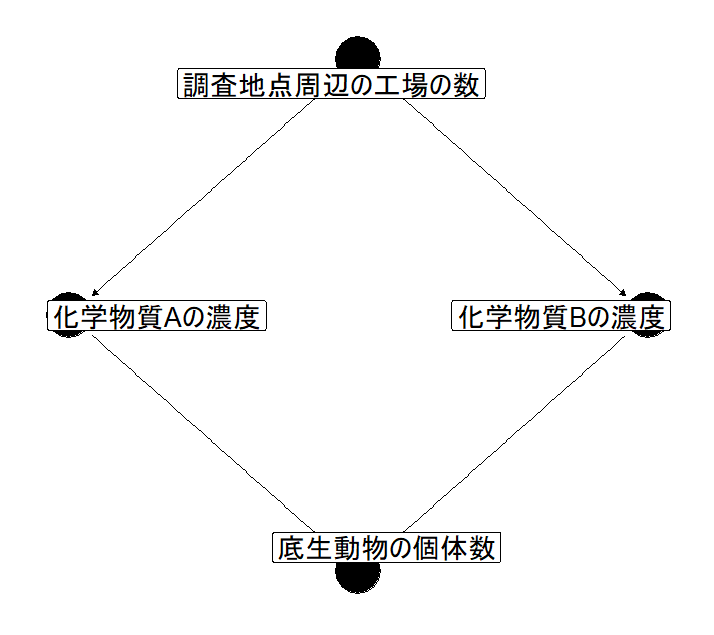
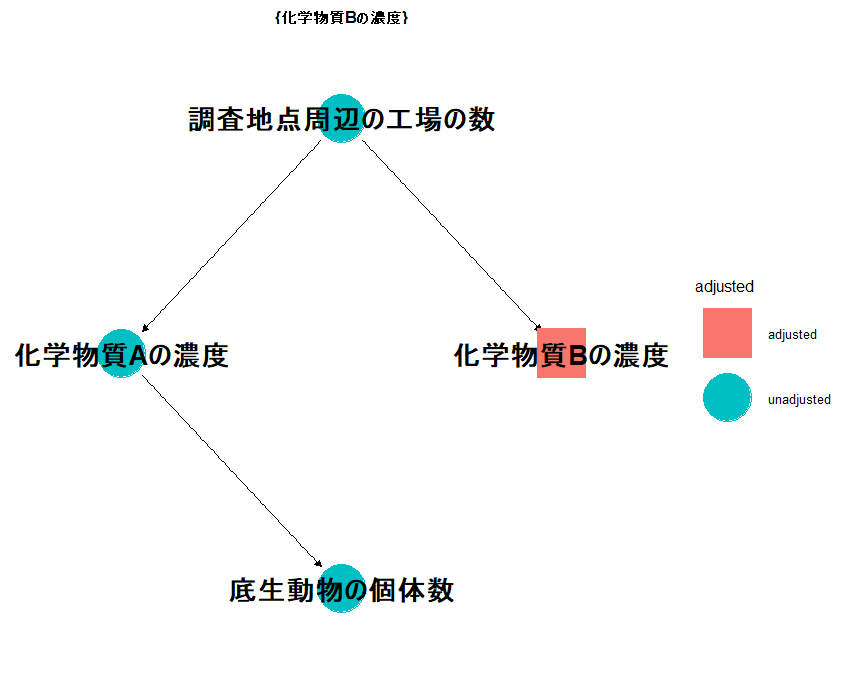

``` r
## Install libaries
library(dagitty); library(ggdag)

example.dag <- dagitty('dag{
                       {"化学物質Aの濃度" "化学物質Bの濃度"} <- "調査地点周辺の工場の数"; 
                        "底生動物の個体数" <- {"化学物質Aの濃度" "化学物質Bの濃度"}
                        "化学物質Aの濃度" [exposure, pos = "-0.5, 0"]
                        "化学物質Bの濃度" [pos = "0.5, 0"]
                        "底生動物の個体数" [outcome, pos = "0, -1"]
                        "調査地点周辺の工場の数" [latent, pos = "0, 1"]
                       }') %>%
  tidy_dagitty()

#On lines 4 and 5, specifies the position of this variable on the DAG
#On line 6, assign exposure variable. Argument "pos" specifies the location of this variable on the DAG.
#On line 8, assign outcome variable
#On line 9, assigning "latent" means that this variable is unobserved variable

#Depict DAG
p <- ggdag(example.dag,
           text = FALSE,
           use_labels = "name",
           node_size = 16,
           text_size = 7.0,
           edge_type = "link"
           )
p <- p + theme_dag()

print(p)
``` 

``` r
#Specify confounders
p <- ggdag_adjustment_set(example.dag,
                          node_size = 17,
                          text_size = 7.0,
                          text_col = "black",
                          shadow = F)
p <- p + theme_dag()

print(p)
dev.off()
``` 

