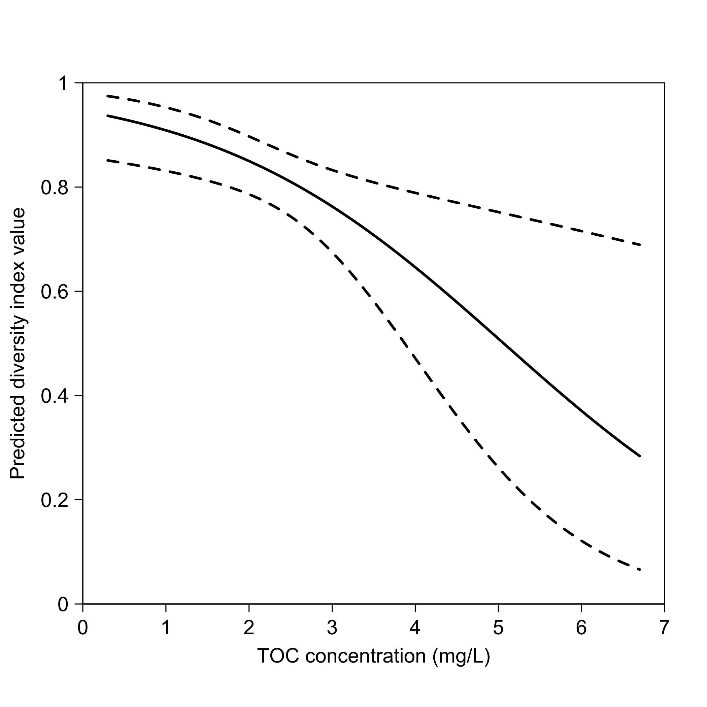
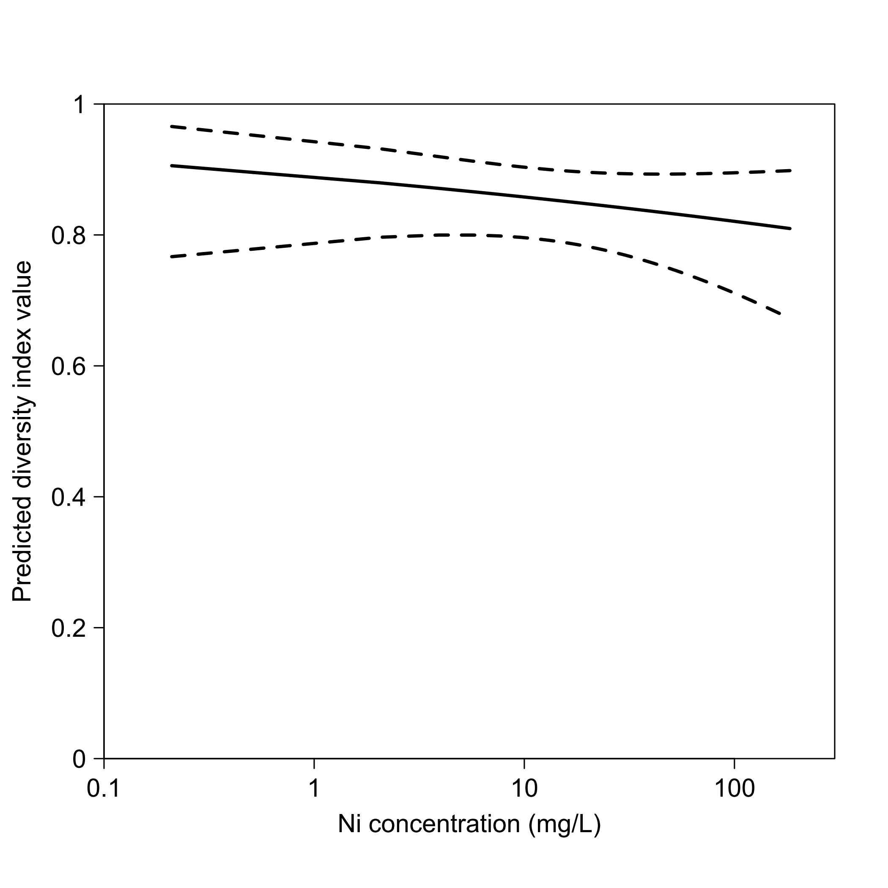
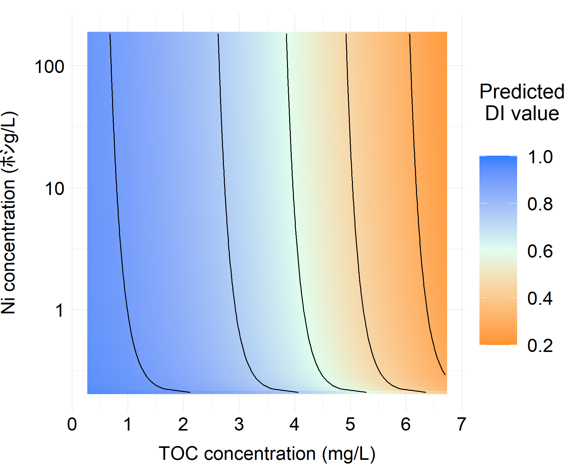

``` r
## Install libaries
library(emmeans)
library(ggplot2)
#R v.4.1.3 and the packages "emmeans" v.1.7.3 and "ggplot2" v. 3.3.5 were used here.

d <- read.table("Data_benthos.txt", sep = ",", header = T) #This data is only partially available on this Github page for various reasons. I appreciate your understanding.
names(d); head(d)
```
[1] "River"   "Insecta" "Ni"      "Zn"      "Cu"      "pH"      "TOC"     "Soil"    "Speed"  
   River Insecta    Ni     Zn    Cu  pH TOC   Soil Speed  
1 River1    0.66  0.80   2.83  0.54 7.6 2.9  Large  0.17  
2 River1    0.54 50.01 111.74 27.69 7.5 4.6  Large  0.38  
3 River1    0.82 44.17  41.16  7.90 7.5 4.5  Small  0.32  
4 River10    0.76  0.78   0.92  0.14 7.7 1.0 Middle  0.73  
5 River10    0.83 44.98  41.97  7.06 7.6 0.9 Middle  0.27  
6 River10    0.81 56.85  48.75  5.57 7.4 0.9 Middle  0.19  
  
``` r
d$Soil <- factor(d$Soil,
                 levels = c("Small", "Middle", "Large")
                 )

## Develop multiple linear regression model----
mod <- glm(Insecta ~ log10(Ni) + log10(Zn) + log10(Cu)
           + pH + TOC + Soil + Speed + River,
           family = gaussian(link = "logit"),
           data = d, na.action = na.fail)

summary(mod)

``` 
Call:  
glm(formula = Insecta ~ log10(Ni) + log10(Zn) + log10(Cu) + pH +   
    TOC + Soil + Speed + River, family = gaussian(link = "logit"),   
    data = d, na.action = na.fail)  
  
Deviance Residuals:   
      Min         1Q     Median         3Q        Max    
-0.189154  -0.034510   0.004731   0.049125   0.086917    
  
Coefficients:  
             Estimate Std. Error t value Pr(>|t|)     
(Intercept)   1.29421    5.96055   0.217  0.83002     
log10(Ni)    -0.27685    0.25843  -1.071  0.29515     
log10(Zn)     0.23925    0.33912   0.706  0.48758     
log10(Cu)     0.54492    0.25229   2.160  0.04145 *   
pH            0.21991    0.75927   0.290  0.77469     
TOC          -0.56566    0.19246  -2.939  0.00737 **  
SoilMiddle   -0.71502    0.46834  -1.527  0.14047     
SoilLarge    -1.03698    0.43189  -2.401  0.02483 *   
Speed         1.10978    0.92481   1.200  0.24235     
RiverRiver10 -1.07529    0.75957  -1.416  0.17028     
RiverRiver11  0.06365    0.61027   0.104  0.91784     
RiverRiver12 -2.29819    0.89298  -2.574  0.01698 *   
RiverRiver13 -0.03800    1.03789  -0.037  0.97111     
RiverRiver14 -1.04044    0.76558  -1.359  0.18732     
RiverRiver2  -1.59134    0.91210  -1.745  0.09439 .   
RiverRiver3  -1.07397    0.78096  -1.375  0.18232     
RiverRiver4  -1.02562    0.83666  -1.226  0.23266     
RiverRiver5   0.09860    0.68019   0.145  0.88600     
RiverRiver6   0.71898    0.53087   1.354  0.18878     
RiverRiver7  -2.18786    0.93860  -2.331  0.02888 *   
RiverRiver8   0.56627    1.10928   0.510  0.61458     
RiverRiver9  -0.94293    0.91782  -1.027  0.31493     

Signif. codes:  0 ‘***’ 0.001 ‘**’ 0.01 ‘*’ 0.05 ‘.’ 0.1 ‘ ’ 1  
  
(Dispersion parameter for gaussian family taken to be 0.009870095)  

Null deviance: 1.0826  on 44  degrees of freedom  
Residual deviance: 0.2270  on 23  degrees of freedom  
AIC: -64.322  
  
Number of Fisher Scoring iterations: 12  
    
``` r
#Calculate estimated marginal means----
x.Ni <- seq(from = min(d$Ni), max(d$Ni), length = 100)
x.TOC <- seq(from = min(d$TOC), max(d$TOC), length = 100)

EMM.Ni <- confint(emmeans(mod,
                          "Ni",
                          at = list(Ni = x.Ni)
                          ),
                  parm,
                  level = 0.95
                  )

EMM.TOC <- confint(emmeans(mod,
                           "TOC",
                           at = list(TOC = x.TOC)
                           ),
                   parm,
                   level = 0.95
                   )

res <- data.frame(Ni = x.Ni,
                  TOC = x.TOC,
                  emm.Ni = EMM.Ni$response,
                  LCL.Ni = EMM.Ni$lower.CL,
                  UCL.Ni = EMM.Ni$upper.CL,
                  emm.TOC = EMM.TOC$response,
                  LCL.TOC = EMM.TOC$lower.CL,
                  UCL.TOC = EMM.TOC$upper.CL
                  )

rm(EMM.Ni, EMM.TOC)

summary(res)
```
|Ni    |TOC   | emm.Ni |          LCL.Ni    |       UCL.Ni    |      emm.TOC    |      LCL.TOC      |     UCL.TOC  
| ---- | ---- |---- | ---- |---- | ---- |---- | ---- |
|Min.   :  0.21 |  Min.   :0.3   |Min.   :0.8098  | Min.   :0.6724  | Min.   :0.8929 |  Min.   :0.2839  | Min.   :0.06618  | Min.   :0.6892    
|1st Qu.: 46.05 | 1st Qu.:1.9  | 1st Qu.:0.8150  | 1st Qu.:0.6914  | 1st Qu.:0.8938  | 1st Qu.:0.4950   |1st Qu.:0.24415  | 1st Qu.:0.7484    
|Median : 91.89 |  Median :3.5 |  Median :0.8223 |  Median :0.7160 |  Median :0.8955 |  Median :0.7078  | Median :0.58084 |  Median :0.8090    
|Mean   : 91.89 | Mean   :3.5  | Mean   :0.8272  | Mean   :0.7236  | Mean   :0.8971  | Mean   :0.6697   |Mean   :0.51959  | Mean   :0.8237    
|3rd Qu.:137.72 |  3rd Qu.:5.1 |  3rd Qu.:0.8341 |  3rd Qu.:0.7518 |  3rd Qu.:0.8972 |  3rd Qu.:0.8569  | 3rd Qu.:0.79231 |  3rd Qu.:0.9039    
|Max.   :183.56 | Max.   :6.7  | Max.   :0.9058  | Max.   :0.7998  | Max.   :0.9656  | Max.   :0.9367   |Max.   :0.85107  | Max.   :0.9746    
```r
cairo_pdf(filename = "Fig_TOC.pdf")

par(mgp = c(1.0, 0.7, 0), xaxs = "i", yaxs = "i")

plot(0, 0,
     xlab = "", ylab = "",
     xaxt = "n", yaxt = "n",
     type = "n",
     xlim = c(0, 7), ylim = c(0, 1),
     frame.plot = F)

lines(res$TOC, res$emm.TOC, col = "black", lwd = 2.5, lty = 1)
lines(res$TOC, res$LCL.TOC, col = "black", lwd = 2.5, lty = 2)
lines(res$TOC, res$UCL.TOC, col = "black", lwd = 2.5, lty = 2)

box("plot", lty = 1)

mtext("Predicted diversity index value",
      side = 2, line = 2.7, cex = 1.2, col = "black", las = 0)
mtext("TOC concentration (mg/L)",
      side = 1, line = 2.1, cex = 1.2, col = "black", las = 0)

axis(1,
     at = seq(0, 7, 1), label = seq(0, 7, 1),
     tck = -0.015, cex.axis = 1.2, las = 1)
axis(2,
     at = seq(0, 1, 0.2), label = seq(0, 1, 0.2),
     tck = -0.015, cex.axis = 1.2, las = 1)

dev.off()
```

```r
#Plot EMM for Ni change----
cairo_pdf(filename = "Fig_Ni.pdf")

par(mgp = c(1.0, 0.7, 0), xaxs = "i", yaxs = "i")

plot(0, 0,
     xlab = "", ylab = "",
     xaxt = "n", yaxt = "n",
     type = "n",
     xlim = c(log10(0.1), log10(300)), ylim = c(0, 1),
     frame.plot = F)

lines(log10(res$Ni), res$emm.Ni, col = "black", lwd = 2.5, lty = 1)
lines(log10(res$Ni), res$LCL.Ni, col = "black", lwd = 2.5, lty = 2)
lines(log10(res$Ni), res$UCL.Ni, col = "black", lwd = 2.5, lty = 2)

box("plot", lty = 1)

mtext("Predicted diversity index value",
      side = 2, line = 2.7, cex = 1.2, col = "black", las = 0)
mtext("Ni concentration (mg/L)",
      side = 1, line = 2.1, cex = 1.2, col = "black", las = 0)

axis(1,
     at = seq(log10(0.1), log10(300), 1), label = c("0.1", "1", "10", "100"),
     tck = -0.015, cex.axis = 1.2, las = 1)
axis(2,
     at = seq(0, 1, 0.2), label = seq(0, 1, 0.2),
     tck = -0.015, cex.axis = 1.2, las = 1)

dev.off()
```

```r
#Heatmap of EMM for TOC and Ni changes----
EMM <- numeric(10000)
xx.Ni <- 10^seq(from = min(log10(d$Ni)), max(log10(d$Ni)), length = 100)

for (i in 1:100) {
  temp <- confint(emmeans(mod,
                          "Ni", "TOC",
                          at = list(Ni = x.Ni,
                                    TOC = x.TOC[i])
                          ),
                  parm,
                  level = 0.95
                  )
  
  EMM[((i - 1) * 100 + 1):((i - 1) * 100 + 100)] <- temp$emmean
  }

res2 <- data.frame(Ni = rep(log10(xx.Ni), times = 100),
                   TOC = rep(x.TOC, each = 100),
                   emm = exp(EMM)/(1 + exp(EMM))
                   )

rm(EMM, i)

summary(res2)
```
|       Ni         |       TOC    |       emm      |  
| ---- | ---- |---- |
| Min.   :-0.67778 |  Min.   :0.3 |  Min.   :0.2299 | 
| 1st Qu.: 0.05761 |  1st Qu.:1.9 |  1st Qu.:0.4527 | 
| Median : 0.79300 |  Median :3.5 |  Median :0.6735 |  
| Mean   : 0.79300 |  Mean   :3.5 |  Mean   :0.6399 | 
| 3rd Qu.: 1.52839 |  3rd Qu.:5.1 |  3rd Qu.:0.8373 | 
| Max.   : 2.26378 |  Max.   :6.7 |  Max.   :0.9618 | 
```r

p <- ggplot(res2, aes(y = Ni, x = TOC, z = emm))
p <- p + theme_minimal()
p <- p + theme(plot.margin = unit(rep(1.1, 4), "lines"),
               axis.title.x = element_text(size = 12 * 1.8, vjust = -1.5),
               axis.title.y = element_text(size = 12 * 1.8, vjust = 4.5),
               axis.text.x = element_text(size = 12 * 1.8, colour = "black"),
               axis.text.y = element_text(size = 12 * 1.8, colour = "black")
               )
p <- p + scale_x_continuous(breaks = seq(0, 7, 1), labels = seq(0, 7, 1))
p <- p + scale_y_continuous(breaks = seq(log10(0.1), log10(300), 1), labels = c("0.1", "1", "10", "100"))
p <- p + xlab("TOC concentration (mg/L)")
p <- p + ylab("Ni concentration (mg/L)")
p <- p + geom_raster(aes(fill = emm), interpolate = F)
p <- p + scale_fill_gradientn(colours = c(rgb(255/256, 149/256, 48/256),
                                          rgb(224/256, 255/256, 238/256),
                                          rgb(47/256, 128/256, 255/256)),
                              limits = c(0.2, 1)
                              )
p <- p + stat_contour(breaks =  c(0.3, 0.45, 0.60, 0.75, 0.90),
                      aes(y = Ni, x = TOC, z = emm),
                      color="black",
                      size = 0.6)
p <- p + theme(legend.title = element_text(size = 13 * 1.8),
               legend.text = element_text(size = 12 * 1.8),
               legend.spacing.y = unit(0.75 * 1.8, 'cm'),
               legend.text.align = 1,
               legend.key.size = unit(0.85 * 1.8, 'cm')
               )
p <- p + labs(fill = "Predicted\n DI value")

png(file = 'Heatmap.png', h = 8.27 * 100 * 1.8, w = 8.27 * 125 * 1.8, res = 200)

print(p)

dev.off()
```

