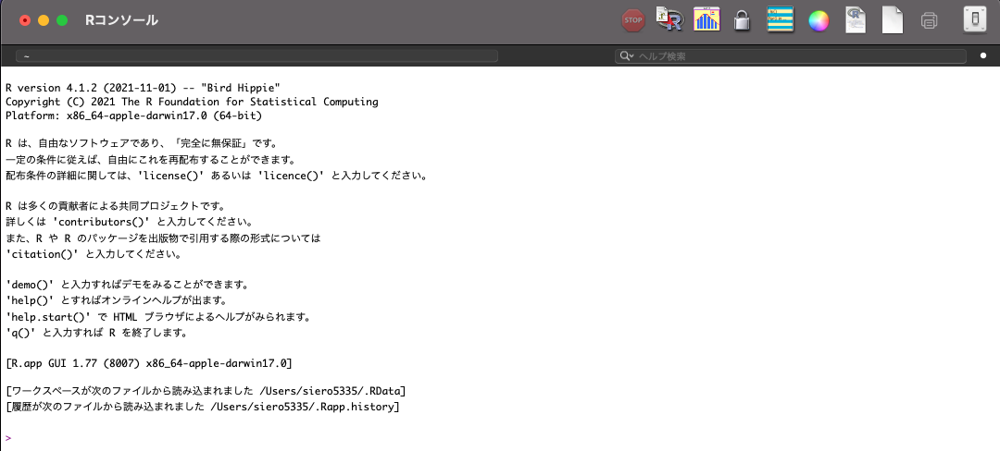
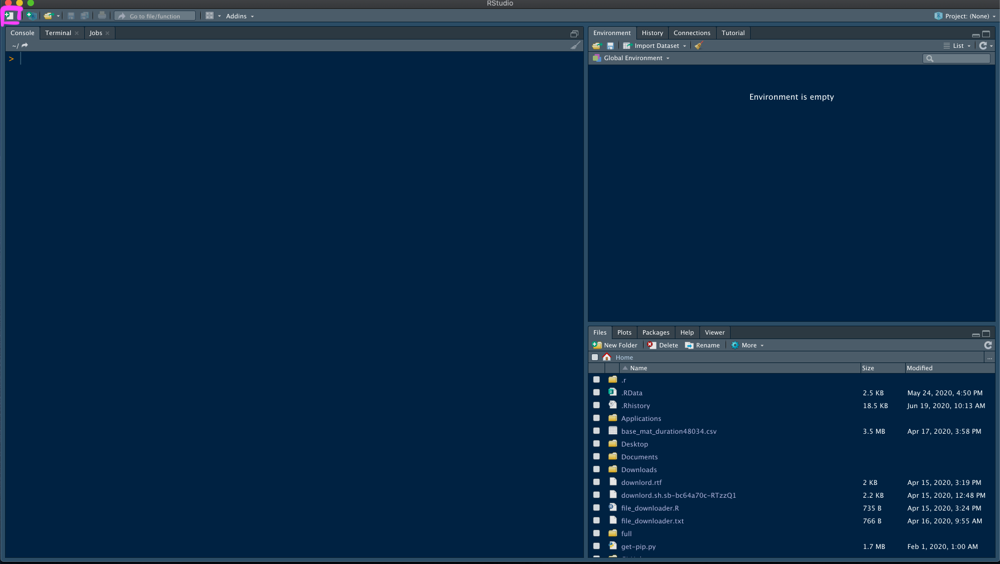
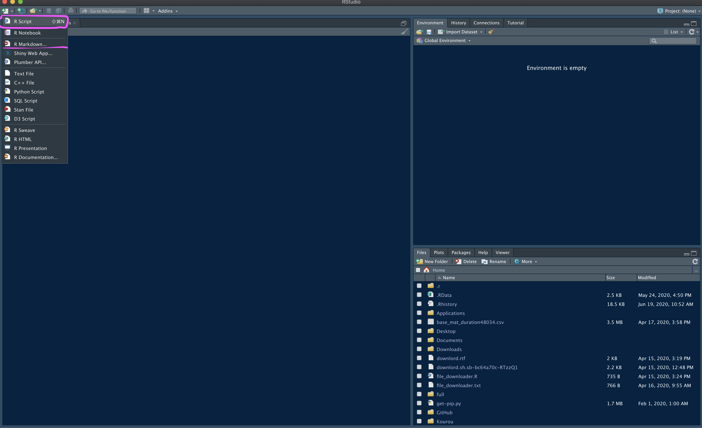
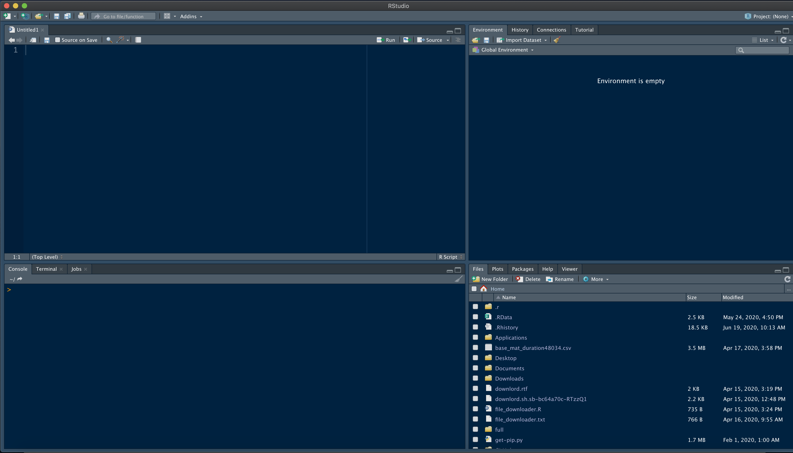
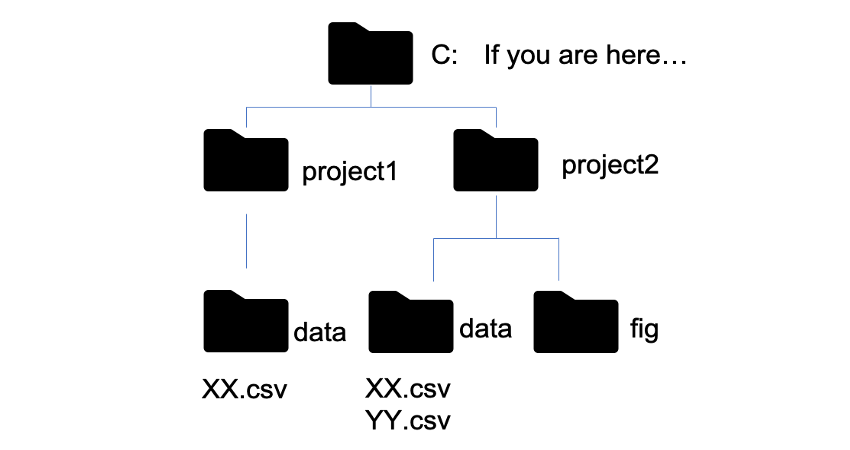
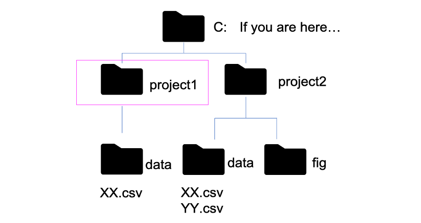
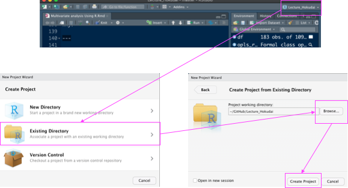
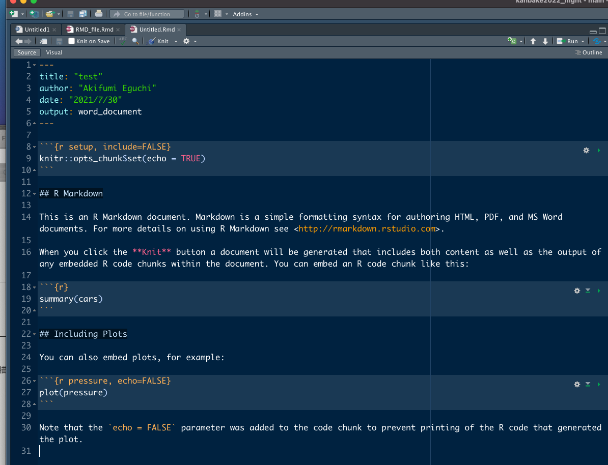
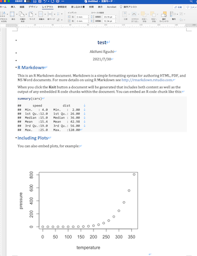

```{r, include=FALSE}
options(htmltools.dir.version = FALSE)
```

```{r xaringan-themer, include=FALSE, warning=FALSE}
library(xaringan)
library(xaringanthemer)

style_duo_accent(
  text_font_size = "30px",
  code_font_size = "20px",
  primary_color = "#134459",
  secondary_color = "#563de3",
  inverse_header_color = "#FFFFFF",
  header_background_color = "#43bf17",
  header_background_auto = TRUE,
  header_h1_font_size = "35px",
  header_h2_font_size = "30px",
  header_h3_font_size = "25px",
  header_font_google = google_font("Noto Sans JP"),
  text_font_google   = google_font("Noto Sans JP"),
)
```

```{css, echo = FALSE}
.remark-slide-content {
  font-size: 18px;
  padding: 20px 80px 20px 80px;
}
.remark-code, .remark-inline-code {
  background: #f0f0f0;
}
.remark-code {
  font-size: 18px;
}
.huge .remark-code { /*Change made here*/
  font-size: 200% !important;
  
}
.tiny .remark-code { /*Change made here*/
  font-size: 50% !important;
  
}
.small .remark-code { /*Change made here*/
  font-size: 66% !important;
  
}
.small2 .remark-code { /*Change made here*/
  font-size: 80% !important;
  
}

```


# Rとは？
オープンソースの統計解析向けプログラミング言語  
  
Windows, Mac, LinuxどれでもOK  
  
パッケージで機能を拡張  
  
高度な可視化や最新の統計手法を利用可  
  
コードを書いて処理を行う必要がある  
---
# Rとは？
コードを書いて処理を行う必要がある  

どうしても慣れが必要・とっつきにくさ  
  
敷居を下げるためのツールも存在
  
記述した内容が残ることはメリットでもある  

レポート・資料を作成するためのプラットフォームがある
---
class: center, middle
# R環境のセットアップ

---

# R環境のセットアップ
### [Base R: downlord from CRAN](https://cran.r-project.org/)
  
--

### [RStudio IDE: downlord from RStudio](https://www.rstudio.com/products/rstudio/)

--

---

# R起動

簡素なUI・書いたコードの再利用が難しい  
→ RStudioの利用を推奨
---

# RStudio起動


---

# RStudio起動


---

# RStudio起動


---
class: center, middle
# パッケージ・データ読み込み

---
# パッケージの導入

 **tidyverse** のパッケージの導入  
 [CRAN](https://cran.r-project.org/):

```{r eval=FALSE, tidy=FALSE}
install.packages("tidyverse")
install.packages("knitr")
install.packages("rmarkdown")
install.packages("GGally")
```

--

Rのパッケージはデータの集計や可視化・解析手法などの機能を追加するための外部ツール。`install.packages()`関数を使うことで [CRAN](https://cran.r-project.org/) に登録されているパッケージをインストールできる(2022/06現在18500種以上)。

---

# パッケージの読み込み

```{r tidy=FALSE, message=FALSE}
library("tidyverse"); library("GGally")
```

インストールしたパッケージを読み込む際には`library()`関数を利用する。インストールはアップデートされたバージョンを使わないのであれば一度で大丈夫だが、パッケージの読み込みはRを立ち上げるたびに行う必要がある。  
この **tidyverse** パッケージはデータの高速な読み込み・加工・集計・可視化などに関わるパッケージ群を一括で使えるようにするためのパッケージ。  
**GGally** パッケージは後の可視化で少し紹介。
---

# データの読み込み
```{r, eval=FALSE}
df <- read_csv("data/demo_data.csv")
```

上記のような記述でcsvファイルを読み込むことができる。  
エクセルの場合は**readxl** パッケージの`read_xlsx()`関数を使う。  

パス (コンピュータ内の住所) の概念を知らないとうまく読めない。

---
# パス

`getwd()`関数で自分のRがどこの住所を参考にしているか調べることができる。

---
# パス

```{r, eval=FALSE}
df <- read_csv("XX.csv") # NG
```

---
# パス

```{r, eval=FALSE}
df <- read_csv("project1/XX.csv") # NG
```

---
# パス

```{r, eval=FALSE}
df <- read_csv("C:¥/project1/data/XX.csv") # OK
```

---
# パス

```{r, eval=FALSE}
df <- read_csv("C:¥/project1/data/YY.csv") # NG
```

---
# パス

```{r, eval=FALSE}
df <- read_csv("C:¥/project2/data/XX.csv") # Other file
```

---
# パス

```{r, eval=FALSE}
df <- read_csv("C:¥/project2/data/YY.csv") # OK
```

---
# パス
正確にパスを書かないといけないのでタイポ等があるだけで読めなくなってしまう
--

```{r, eval=FALSE}
setwd("C:¥/project1/")
df <- read_csv("data/XX.csv") # OK
```
`setwd()`関数で自分のRが参考にしている住所を指定できる
---
# パス

  
`setwd()`関数で自分のRが参考にしている住所を指定できる

---
# プロジェクト



プロジェクトを作ることで特定のフォルダを参照フォルダにできる

---
# プロジェクト
```{r, warning=F, message=F}
df <- read_csv("data/demo_data.csv") # OK
```

一番シンプルな記述で読み込みができるように

---
class: center, middle
# データ確認・加工

---
# データの確認
```{r, tidy=FALSE}
head(df)
```
ID含めて変数は7個、性別以外は数値
---

# データの確認
```{r}
summary(df)
```

min, max, mean, median, 1st, 3rd quartilesを`summary()`関数1つで確認できる

---
# データの集計
**tidyverse**に含まれる**dplyr**はtableデータの操作に適したパッケージ  
データの加工・集計の際に便利  
内部で読み込まれる**magrittr**パッケージの機能でパイプ `%>%` を使ってパイプの左側に記述したデータをパイプの右側の処理に受け渡す  
連続してパイプをつないでまとめていろいろな処理ができる

---
# dplyrの主な関数
## select(): 特定の列を選択  

## filter(): 特定の行を選択  

## group_by(): 特定の変数に基づいてグループを作る

## summarise(): グループ化したデータに基づいて集計する

## mutate(): 新しい変数を作る

## XX_join(): 共通する変数に基づいて2つのデータを結合する (今回は解説せず)

---
# select(): 列の選択
```{r}
df %>% select(Age, Gender, outcome)
```

目的の列のみを`select()`で抽出

---
# select(): 列の選択
```{r}
df %>% select(!c(Age, Gender, outcome))
```
!をつけると選択した列以外を抽出できる

---
# filter(): 行の選択
```{r}
df %>% filter(Gender == "Female") 
```

`filter()`では行の抽出が可能  
上記では性別 (Gender) がFemaleの行のみを抽出  
文字列の場合は""で囲んで文字列として取り扱う

---
# filter(): 行の選択
```{r, eval=F}
head( df %>% filter(Height > 150 & Gender == "Female") )
```
組み合わせも可能 (身長150cm以上の女性)

---
# group_by(): グルーピング
主にデータの集計に用いられる関数   
関数の()内にグルーピングに使いたい変数を記入する

```{r}
head( df %>% group_by(Gender) )
```

単に`group_by()`関数に渡すだけではデータの見た目は変わらない

---
# summarise(): グルーピングしたデータの集計

```{r}
df %>% group_by(Gender) %>% 
　summarise(N = n(), H = mean(Height), W = max(Weight))
```
`summarise()`は名の通りグルーピングしたデータを集計するための関数  
`n()`, `mean()`, `sum()`, `sd()`などの関数を使って、  
`group_by()`関数で指定した変数で集計値を計算できる

---
# mutate(): 変数の追加
```{r}
head( df %>% mutate(BMI = Weight / (Height/100)^2,
                    BMI = round(BMI, digits = 1)) )
```
`mutate()`関数は新しい変数を追加するための関数  
データの組み合わせて様々な加工も可能  
上記では身長と体重からBMIをつくっている

```{r, include=F}
df <- df %>% mutate(BMI = Weight / (Height/100)^2,
                    BMI = round(BMI, digits = 1)) 
```
---

class: center, middle
# 作図

---
# 作図
**tidyverse**に含まれる**ggplot2**パッケージが広く利用されている  
作ることができる図の種類が多い  
レイヤー構造になっており柔軟性が高い  
きれいな図を作ることができる（好みはあるが…

---
# ggplot2
```{r, fig.width=12, fig.height=5, warning=F}
ggplot(df, aes(x = Gender, y = BMI))
```
レイヤーの1段目  
`ggplot()`関数内にデータを指定し、`aes()`関数でx, y軸などを指定しておく 
x, y軸がそれぞれ指定されるが出力される図は外側だけ

---
# ggplot2
```{r, fig.width=12, fig.height=5, warning=F}
ggplot(df, aes(x = Gender, y = BMI)) + geom_boxplot()
```

 
`geom_XX()`関数をつなげ、作りたい出力レイヤーを指定する

---
# 代表的なgeom_XX
## geom_boxplot(): 箱ひげ図をつくる

## geom_point(): 散布図をつくる

## geom_smooth(): 回帰直線を引く

## geom_histogram(): ヒストグラムをつくる

## geom_bar(): 棒グラフをつくる

---
# geom_boxplot()
```{r, fig.width=12, fig.height=5, warning=F}
ggplot(df, aes(x = Gender, y = BMI, fill = Gender)) + geom_boxplot()
```

`fill`, `color`引数に変数を指定することで色分けも可能

---
# 散布図
```{r, fig.width=8, fig.height=4, warning=F}
ggplot(df, aes(x = Height, y = Weight, color = Gender)) + 
  geom_point() 
```
`geom_point()`で各検体の身長・体重を性別ごとに図示

---
# 散布図
```{r, fig.width=8, fig.height=4, warning=F, message=F}
ggplot(df, aes(x = Height, y = Weight, color = Gender)) + 
  geom_point() +
  geom_smooth(method = "lm")
```
`geom_smooth()`で先程の図にレイヤーを追加する形で回帰直線を追加

---
# 散布図行列
```{r, fig.width=8, fig.height=4, warning=F, message=F}
ggpairs(df)
```

**GGally**パッケージを利用することで相関行列を一気に作ることもできる
---

# 散布図行列
```{r, fig.width=8, fig.height=4, warning=F, message=F}
ggpairs(df, aes(color = Gender))
```

`aes()`関数に変数を渡して色分けした図にもできる  
そのまま論文の図にするにはうるさいかもしれないが探索に有効

---
class: center, middle
# レポーティング

---
#RMarkdown

Markdownの派生  
  
文章とコードをひとまとめにして出力するための機能  
  
html, word, PDF, pptxなど、様々な形式に出力可能  
  
データ・乱数・パッケージなどが固定されていればいつも同じ出力  
  
sessionInfo()関数で現在のR、パッケージのバージョン情報を出力可

---
#RMarkdown

---
#RMarkdown


---
#RMarkdown



---
#RMarkdown
bibtexと連携して引用文献をつけることもできる  
一部論文誌フォーマットも用意されている
  
メモ帳代わりにでもコードと結果・考察をまとめておくことは助けになる  

本スライドもRMarkdownおよびxaringanパッケージを使って作ったもの  
コードはアップロード予定

RMarkdownでも可能だが、開発中のQuartoを利用することでR, Python, Juliaなど、  
複数のデータ解析に関わる言語にまたがった処理も可能になりつつある  

---
# 参考資料
[RユーザのためのRStudio"実践"入門](https://gihyo.jp/book/2021/978-4-297-12170-9)  
  
[Rが生産性を高める](https://gihyo.jp/book/2022/978-4-297-12524-0)  
  
[データ分析のためのデータ可視化入門](https://www.kspub.co.jp/book/detail/5164044.html)  
  
[再現可能性のすゝめ](https://www.kyoritsu-pub.co.jp/book/b10003938.html)  
  
[自然科学研究のためのR入門](https://www.kyoritsu-pub.co.jp/book/b10003117.html)  

---
# 実行環境
.tiny[
```{r, }
sessioninfo::session_info()
```

]
---
class: inverse, middle, center

# Enjoy !

---
```{r, eval=FALSE, include=F}
xaringan::decktape("outline_R_3gakkai_eguchi.html", "outline_R_3gakkai_eguch.pdf", docker = FALSE)
```